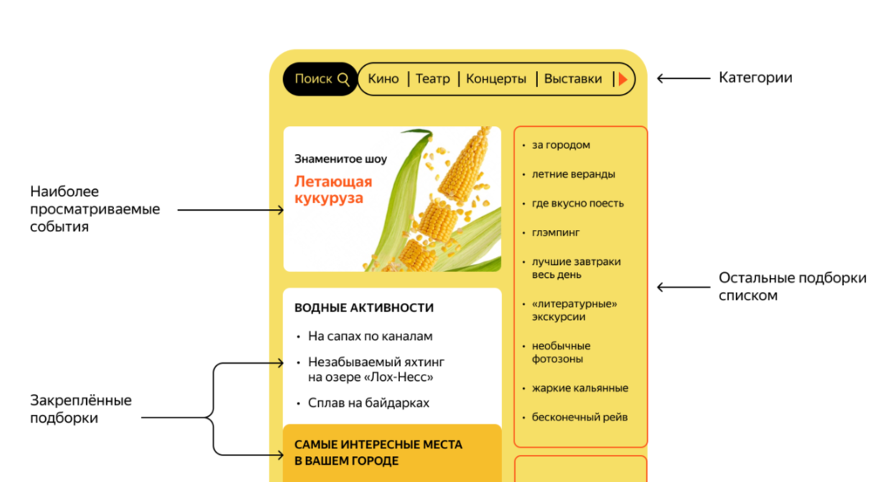
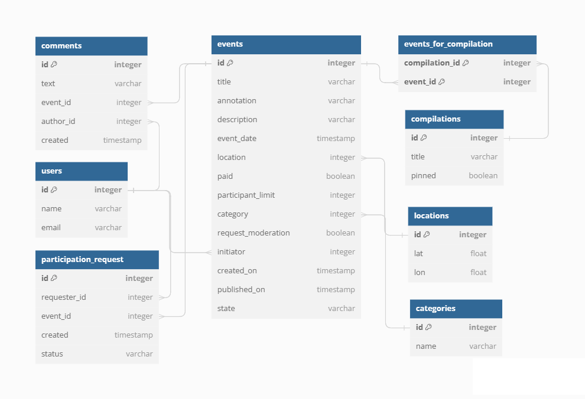
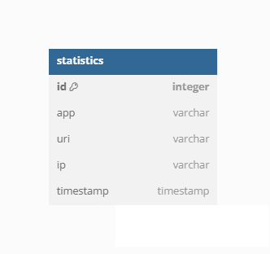

# Explore with me

### Описание

Свободное время — ценный ресурс. Ежедневно мы планируем, как его потратить — куда и с кем сходить. Сложнее всего в таком планировании поиск информации и переговоры. Нужно учесть много деталей: какие намечаются мероприятия, свободны ли в этот момент друзья, как всех пригласить и где собраться.

Приложение "Исследуй вместе со мной" является афишей различных мероприятий.

Посетителю предлагается набор событий, отсортированных по категориям, популярности, актуальности.

Зарегистрированный пользователь может публиковать новое событие, просматривать события других пользователей с определённой фильтрацией, принимать в них участие и оставлять комментарии к событиям.

Программой предусмотренно использование пользователем или администратором. У каждого из них есть свои возможности и ограничения.

#### Пользовательский интерфейс

- Не зарегистрированные пользователи имеют возможность просматривать категории событий, подборки событий и сами события с комментариями к ним (с возможностью использования фильтрации и пагинации).
- Зарегистрированные пользователи могут добавлять и измениять события, комментировать обытия, отправлять/отменять запрос на участие в событии другого пользователя, а так же принимать/отклонять запросы к своим событиям от других пользователей.

#### Интерфейс администратора

- добавлять, получать, удалять пользователей;
- получать и изменять события;
- создавать/изменять/удалять категории и подборки событий;
- получать и удалять комментарии.

### Особенности разработки

Программа написана на языке Java с использованием IntelliJ IDEA.
Сборка проекта реализуется с помощью Maven, а так же была реализована работа с платформой Docker.
Приложение является примером микросервисной архитектуры, состоящим из двух модулей (основного сервиса и сервиса статистики).

#### Особенности взаимодействия двух модулей:

При обращении к эндпоинту получения события/событий, отправляется запрос в модуль статистики в gateway, где происсходит  валидация данных и их отправка в основной сервис статистики, где они сохраняются в базу данных.

При необходимости получения информации о колличестве просмотров события, происходит запрос в модуль статистики, для получения результата.

Для передачи данных используются объекты классов собственной бибилиотеки.

Для хранения данных используется реляционная БД PostgreSQL.

#### Схема БД основного сервиса

**`users`**

Содержит информацию о пользователях.

- `id` - идентификатор пользоватея (первичный ключ);
- `name` - имя пользователя;
- `email` - адрес электронной почты пользователя.

**`events`**

Содержит информацию о событии.

- `id` - идентификатор пользоватея (первичный ключ);
- `title` - название события;
- `annotation` - краткое описание события;
- `description` - развёрнутое описание события;
- `event_date` - дата проведения события;
- `location` - местоположение события;
- `paid` - необходимость оплаты посещения события;
- `participant_limit` - ограничение на колличество участников;
- `category` - категория, к которой относится событие;
- `request_moderation` - необходимость модерации запроса на участие;
- `initiator` - инициатор события;
- `created_on` - дата создания записи о событии;
- `published_on` - дата публикации события;
- `state` - статус события;

**`categories`**

- `id` - идентификатор категории;
- `name` - название категории.

**`locations`**

- `id` - идентификатор локации;
- `lat` - географическая координата локации (широта);
- `lon` - географическая координата локации (долгота).

**`compilations`**

- `id` - идентификатор подборки;
- `title` - название подборки;
- `pinned` - закреплённость подборки.

**`events-for-compilations`**

- `compilation_id` - идентификатор подборки;
- `event_id` - идентификатор события, входящего в подборку;

**`participation_request`**

- `id` - идентификатор запроса на участие в событии;
- `requester_id` - идентификатор пользователя, отправившего запрос;
- `event_id` - идентификатор события;
- `created` - дата отправки запроса;
- `status` - статус заявки на участие.

**`comments`**

- `id` - идентификатор комментария;
- `text` - текст комментария;
- `event_id` - идентификатор события, к которому относится комментарий;
- `author_id` - идентификатор пользователя, оставившего комментарий;
- `created` - дата создания комментария.

#### Схема базы данных сервиса статистики

**`statistics`**

- `id` - идентификатор записи в статистике;
- `app` - идентификатор сервиса для которого записывается информация;
- `uri` - URI для которого был осуществлен запрос;
- `ip` - IP-адрес пользователя, осуществившего запрос;
- `timestamp` - дата и время, когда был совершен запрос к эндпоинту.

